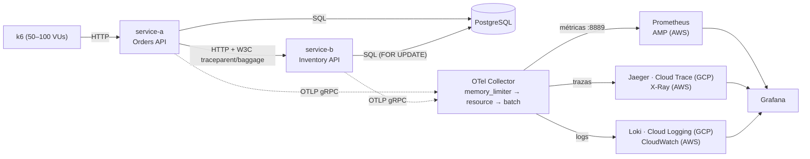

# LAB · Pipeline OpenTelemetry end-to-end con Jaeger y Prometheus en GCP y AWS

Pipeline de observabilidad basado en **OpenTelemetry** para dos microservicios Python
(`service-a → service-b`) con base de datos PostgreSQL. Emite los tres pilares (**trazas, métricas
y logs**), los envía a un **OTel Collector** y los correlaciona en Grafana usando el `trace_id` como
pivote. Corre en local con Docker, está desplegado en **GCP (GKE)** y tiene la infraestructura de
**AWS (ECS Fargate)** definida en Terraform.

**Materia:** Observabilidad en ambientes productivos · **Integrantes:** David Aníbal Vásquez,
Sergio Andrés Cobos y Sebastián Bedoya Flórez

| Entregable | Dónde |
|---|---|
| Código de instrumentación OTel (SDK) | [`services/`](services/) |
| Configuración del OTel Collector | [`collector/`](collector/) |
| Manifiestos IaC (Terraform + Helm) | [`deploy/`](deploy/) |
| Capturas de Jaeger, Grafana, GCP, etc. | [`evidencias/`](evidencias/) |
| Dashboards de Grafana | [`observability/grafana/dashboards/`](observability/grafana/dashboards/) |
| Reporte técnico (PDF y Word) | [`docs/reporte-tecnico.pdf`](docs/reporte-tecnico.pdf) · [`docs/reporte-tecnico.docx`](docs/reporte-tecnico.docx) |

## Contenido

1. [Arquitectura](#1-arquitectura)
2. [Estructura del proyecto](#2-estructura-del-proyecto)
3. [Requisitos](#3-requisitos)
4. [Ejecución local](#4-ejecución-local)
5. [API de los servicios](#5-api-de-los-servicios)
6. [Variables de configuración](#6-variables-de-configuración)
7. [Benchmark de overhead (Fase 4)](#7-benchmark-de-overhead-fase-4)
8. [Despliegue en GCP (GKE)](#8-despliegue-en-gcp-gke)
9. [Despliegue en AWS (ECS Fargate)](#9-despliegue-en-aws-ecs-fargate)
10. [Reporte técnico y evidencias](#10-reporte-técnico-y-evidencias)
11. [Solución de problemas](#11-solución-de-problemas)
12. [Decisiones de diseño](#12-decisiones-de-diseño)

---

## 1. Arquitectura



| Componente | Tecnología | Rol |
|---|---|---|
| service-a (órdenes) | Python 3.12, FastAPI, SQLAlchemy, httpx | Recibe órdenes y reserva stock en service-b |
| service-b (inventario) | Python 3.12, FastAPI, SQLAlchemy | Descuenta stock en PostgreSQL (`SELECT … FOR UPDATE`) |
| Instrumentación | OTel Python SDK 1.45 / instrumentaciones 0.66b0 | Genera trazas, métricas y logs (`services/shared/telemetry.py`) |
| OTel Collector | `otelcol-contrib` 0.162.0 | Recibe OTLP, procesa y enruta a cada backend según el entorno |
| Jaeger | 2.20.0 | Backend de trazas |
| Prometheus | 3.13 | Backend de métricas (scrapea el Collector en `:8889` y `:8888`) |
| Loki | 3.7 | Backend de logs (recibe OTLP; `trace_id` como *structured metadata*) |
| Grafana | 13 | Dashboard de 6 paneles y correlación logs ↔ trazas ↔ métricas |
| k6 | 2.3 | Generador de carga para el benchmark |

### Qué emite cada servicio (Fase 1)

- **Auto-instrumentación:** FastAPI (span por request y métricas `http.server.*`), httpx (span
  cliente que inyecta `traceparent`) y SQLAlchemy (span por consulta).
- **Spans de negocio:** `orders.validate`, `orders.reserve_inventory`, `orders.calculate_total`
  (service-a) e `inventory.reserve_stock` (service-b).
- **Métricas propias:** `orders.created`, `orders.value`, `orders.inventory.call.duration`,
  `inventory.reservations`, `inventory.reserved.units`, y CPU/memoria del proceso.
- **Logs:** JSON en stdout con `trace_id`, `span_id` y `trace_flags`, y el mismo registro por OTLP.
- **Propagación:** W3C TraceContext + Baggage (`customer.id` viaja de service-a a service-b).
- **Falla inyectada:** service-b falla el 1% de las reservas (503) para que haya errores reales.

Traza resultante de `POST /api/orders` (~20 spans):

```text
service-a  POST /api/orders                              (SERVER)
├── orders.validate                                      (negocio)
├── orders.reserve_inventory                             (negocio)
│   └── POST                                             (CLIENT httpx → traceparent)
│       └── service-b POST /api/products/{id}/reserve    (SERVER)
│           └── inventory.reserve_stock                  (negocio)
│               ├── SELECT ... FOR UPDATE                (DB)
│               ├── UPDATE products                      (DB)
│               └── INSERT stock_movements               (DB)
├── orders.calculate_total                               (negocio)
└── INSERT orders                                        (DB)
```

## 2. Estructura del proyecto

```text
OpenTelemetry/
├── services/                      # Fase 1: código instrumentado
│   ├── shared/telemetry.py        #   configuración OTel común (trazas, métricas, logs, propagación)
│   ├── service-a/                 #   Orders API
│   ├── service-b/                 #   Inventory API
│   └── Dockerfile                 #   imagen común (--build-arg SERVICE=service-a|service-b)
├── collector/                     # Fase 2: configuración del OTel Collector
│   ├── otel-collector-local.yaml  #   Jaeger + Prometheus + Loki
│   ├── otel-collector-gcp.yaml    #   + Cloud Trace + Cloud Logging
│   └── otel-collector-aws.yaml    #   X-Ray + CloudWatch Logs + Amazon Managed Prometheus
├── observability/                 # Fase 3: backends locales
│   ├── prometheus/prometheus.yml
│   ├── loki/loki-config.yaml
│   └── grafana/                   #   datasources con correlación + dashboard de 6 paneles
├── benchmark/                     # Fase 4: análisis de overhead
│   ├── k6/load-test.js            #   escenario de carga (usuarios concurrentes o tasa fija)
│   ├── run-benchmark.sh           #   baseline vs OTel 100% vs OTel 10%
│   ├── run-ablation.sh            #   costo por componente (trazas / métricas / logs)
│   ├── analyze.py                 #   genera las tablas de resultados
│   └── results/                   #   resultados obtenidos (JSON de k6, CSV de docker stats, reportes)
├── deploy/
│   ├── gcp/                       #   Terraform (GKE, Artifact Registry, Workload Identity) + scripts
│   ├── aws/                       #   Terraform (ECS Fargate, ALB, Cloud Map, X-Ray, CloudWatch, AMP)
│   └── helm/otel-lab/             #   chart: servicios, Postgres, Collector, Jaeger, Loki, ServiceMonitor
├── docs/                          # reporte técnico (md → PDF/Word) y guía de despliegue en GCP
├── evidencias/                    # capturas de pantalla del laboratorio
└── docker-compose.yml             # stack local completo
```

## 3. Requisitos

| Para | Herramientas | Instalación en macOS |
|---|---|---|
| Ejecución local y benchmark | Docker + Compose v2 (se usó **Colima**) | `brew install colima docker docker-compose docker-buildx` |
| Despliegue en GCP | `gcloud`, `gke-gcloud-auth-plugin`, Terraform ≥ 1.6, `kubectl`, Helm 3 | `brew install --cask gcloud-cli` · `gcloud components install gke-gcloud-auth-plugin` · `brew tap hashicorp/tap && brew install hashicorp/tap/terraform` · `brew install kubectl helm` |
| Despliegue en AWS | `aws` CLI, Terraform, Docker con `buildx` | `brew install awscli` |
| Regenerar el informe | Python 3 + `markdown`, Google Chrome, Node.js + `docx` y `marked` | ver [sección 10](#10-reporte-técnico-y-evidencias) |

Configuración de Colima (una sola vez):

```bash
colima start --cpu 6 --memory 8
```
```bash
docker context use colima
```

Para que funcionen `docker compose` y `docker buildx`, agrega a `~/.docker/config.json`:

```json
{ "cliPluginsExtraDirs": ["/opt/homebrew/lib/docker/cli-plugins"] }
```

> Después de reiniciar el Mac, Colima queda detenido: vuelve a ejecutar `colima start`.

## 4. Ejecución local

### 4.1 Levantar el stack

```bash
cd OpenTelemetry
docker compose up -d --build
```

Levanta 8 contenedores: postgres, service-a, service-b, otel-collector, jaeger, prometheus, loki y
grafana.

| UI / endpoint | URL | Credenciales |
|---|---|---|
| API service-a (Swagger) | http://localhost:8000/docs | — |
| API service-b (Swagger) | http://localhost:8001/docs | — |
| Jaeger UI | http://localhost:16686 | — |
| Grafana | http://localhost:3000 | `admin` / `admin` (el acceso anónimo tiene rol Editor) |
| Dashboard de SLIs | http://localhost:3000/d/otel-lab-slis | — |
| Prometheus | http://localhost:9090 (targets: `/targets`) | — |
| Collector: métricas de la app / internas | http://localhost:8889/metrics · http://localhost:8888/metrics | — |
| Collector: health / zpages | http://localhost:13133 · http://localhost:55679/debug/tracez | — |
| Loki (API) | http://localhost:3100 | — |

### 4.2 Probar una orden

La respuesta trae el `trace_id`, en el body y en el encabezado `X-Trace-Id`:

```bash
curl -i -X POST http://localhost:8000/api/orders -H 'content-type: application/json' -d '{"customer_id":"c-1","product_id":3,"quantity":12}'
```

Abre la traza en Jaeger con `http://localhost:16686/trace/<trace_id>` y busca sus logs en stdout:

```bash
docker compose logs service-a service-b | grep <trace_id>
```

### 4.3 Generar tráfico para los dashboards

```bash
VUS=50 DURATION=3m docker compose --profile loadtest run --rm k6
```

### 4.4 Correlación entre señales (trace_id como pivote)

1. **Log → traza:** Grafana › Explore › Loki › `{service_name="service-b"} | trace_id != ""` ›
   expande una línea › **"Ver traza en Jaeger"** (se abre en vista dividida).
2. **Traza → logs:** Grafana › Explore › Jaeger › abre una traza › en un span, **"Logs for this span"**.
3. **Traza → métricas:** desde el span, el enlace "Latencia p99 del servicio" abre la consulta en Prometheus.
4. **Errores:** Jaeger › Search › Service `service-a` › Tags `error=true` › Lookback `Last 15 minutes`.

### 4.5 Apagar

```bash
docker compose down        # conserva volúmenes
```
```bash
docker compose down -v     # borra también los datos
```
```bash
colima stop                # libera la CPU y memoria de la VM
```

### 4.6 Ejecutar los servicios sin Docker (opcional)

Útil para depurar. Usan SQLite si no se define `DATABASE_URL`:

```bash
cd OpenTelemetry/services && python3 -m venv .venv && .venv/bin/pip install -r service-a/requirements.txt
```
```bash
cd OpenTelemetry/services/service-b && OTEL_SERVICE_NAME=service-b OTEL_EXPORTER_OTLP_ENDPOINT=http://localhost:4317 ../.venv/bin/uvicorn app.main:app --port 8001
```
```bash
cd OpenTelemetry/services/service-a && OTEL_SERVICE_NAME=service-a OTEL_EXPORTER_OTLP_ENDPOINT=http://localhost:4317 SERVICE_B_URL=http://localhost:8001 ../.venv/bin/uvicorn app.main:app --port 8000
```

## 5. API de los servicios

| Servicio | Método y ruta | Descripción |
|---|---|---|
| service-a | `POST /api/orders` | Crea una orden: `{"customer_id": "...", "product_id": 1-50, "quantity": 1-100}` |
| service-a | `GET /api/orders/{id}` | Consulta una orden |
| service-a | `GET /api/orders?limit=20` | Últimas órdenes |
| service-a | `GET /api/catalog?limit=20` | Catálogo (llama a service-b) |
| service-b | `GET /api/products` · `GET /api/products/{id}` | Productos (se siembran 50 al arrancar) |
| service-b | `POST /api/products/{id}/reserve` | Reserva stock: `{"quantity": n, "order_ref": "..."}` |
| ambos | `GET /health/live` · `GET /health/ready` | Sondas de salud (no generan trazas) |

## 6. Variables de configuración

| Variable | Valor por defecto | Efecto |
|---|---|---|
| `OTEL_SDK_DISABLED` | `false` | `true` = modo baseline: sin providers ni instrumentación |
| `OTEL_TRACES_EXPORTER` / `OTEL_METRICS_EXPORTER` / `OTEL_LOGS_EXPORTER` | `otlp` | `none` desactiva esa señal (usado en la ablación) |
| `OTEL_TRACES_SAMPLER` / `OTEL_TRACES_SAMPLER_ARG` | `parentbased_always_on` / `1.0` | Muestreo; p. ej. `parentbased_traceidratio` + `0.1` = 10% |
| `OTEL_EXPORTER_OTLP_ENDPOINT` | `http://otel-collector:4317` | Dirección del Collector |
| `OTEL_SERVICE_NAME` | `service-a` / `service-b` | Nombre del servicio en la telemetría |
| `OTEL_SEMCONV_STABILITY_OPT_IN` | `http` | Usa las convenciones HTTP estables (`http.server.request.duration` en segundos) |
| `OTEL_METRIC_EXPORT_INTERVAL` | `10000` | Cada cuántos ms se exportan métricas |
| `CHAOS_FAILURE_RATE` | `0.01` | Fracción de reservas que fallan a propósito en service-b |
| `CHAOS_LATENCY_MS` | `0` | Latencia aleatoria máxima añadida en service-b |
| `DATABASE_URL` | Postgres en compose / SQLite fuera de Docker | Cadena de conexión SQLAlchemy |
| `SERVICE_B_URL` | `http://service-b:8000` | Dirección de service-b desde service-a |
| `LOG_LEVEL` | `INFO` | Nivel de log |

Variables de k6 (`docker compose --profile loadtest run --rm k6`):

| Variable | Defecto | Efecto |
|---|---|---|
| `VUS` | `100` | Usuarios concurrentes |
| `DURATION` | `5m` | Duración |
| `RATE` | `0` | Si es > 0, usa tasa fija de iteraciones/s en lugar de usuarios con pausas |
| `RUN_LABEL` | `manual` | Nombre del archivo de resultados en `benchmark/results/` |

Cualquier variable se puede sobrescribir al levantar el stack, por ejemplo:

```bash
OTEL_TRACES_SAMPLER=parentbased_traceidratio OTEL_TRACES_SAMPLER_ARG=0.1 CHAOS_FAILURE_RATE=0.05 docker compose up -d
```

## 7. Benchmark de overhead (Fase 4)

### 7.1 Experimento A: con vs sin instrumentación

```bash
cd OpenTelemetry && ./benchmark/run-benchmark.sh
```

Corre 3 casos de 100 usuarios × 5 minutos (~22 min en total). Variantes:

```bash
VUS=50 ./benchmark/run-benchmark.sh
```
```bash
CASES="otel-sampled" ./benchmark/run-benchmark.sh
```

| Caso | Configuración |
|---|---|
| `baseline` | `OTEL_SDK_DISABLED=true`, sin Collector ni backends |
| `otel` | Instrumentación completa, muestreo 100% |
| `otel-sampled` | Instrumentación completa, muestreo head-based 10% |

Cada caso reinicia el stack desde cero, hace un calentamiento de 30 s y corre k6 mientras muestrea
`docker stats`. Los servicios están limitados a **1 CPU / 512 MiB**. El resultado queda en
[`benchmark/results/overhead-report.md`](benchmark/results/overhead-report.md).

### 7.2 Experimento B: costo por componente (ablación)

```bash
cd OpenTelemetry && ./benchmark/run-ablation.sh
```

Corre 7 variantes a ~90 req/s fijos, 2 minutos cada una (~25 min). Para repetir solo una:

```bash
ONLY="completo" ./benchmark/run-ablation.sh
```

Activa cada señal por separado y reporta el **CPU por request en estado estable** y el porcentaje
de tiempo saturado en
[`benchmark/results/ablation/ablation-report.md`](benchmark/results/ablation/ablation-report.md).

### 7.3 Resultados principales

| Medida | Resultado |
|---|---|
| Latencia p99 adicional (100 usuarios × 5 min) | +818 ms (+183%), con service-a saturado |
| Throughput sostenible | −28% |
| Costo de CPU por request (instrumentación completa) | +5.06 ms (+161%); trazas +2.6 ms, métricas +1.0 ms, logs +0.9 ms |
| Memoria adicional | +18 a +22 MiB por servicio (~30%) |
| Costo del Collector | 5–7% de un núcleo y ~85 MiB |
| Con muestreo del 10% | +2.74 ms por request y tiempo saturado de 29–67% → 2% |

La interpretación completa está en la sección 6 del [reporte técnico](docs/reporte-tecnico.pdf).

## 8. Despliegue en GCP (GKE)

Guía detallada paso a paso: [`docs/guia-despliegue-gcp.md`](docs/guia-despliegue-gcp.md).

> ⚠️ Genera costo mientras los nodos están encendidos (~US$0.30–0.40/hora con 2 nodos
> `e2-standard-4`). Usa [pausar](#83-pausar-reanudar-y-destruir) al terminar.

### 8.1 Autenticación (una sola vez)

```bash
gcloud auth login
```
```bash
gcloud auth application-default login
```
```bash
gcloud auth application-default set-quota-project fundamentos-devops
```

### 8.2 Desplegar

```bash
cd OpenTelemetry/deploy/gcp && PROJECT_ID=fundamentos-devops ./deploy.sh
```

El despliegue tarda unos 15–20 minutos y hace lo siguiente:

1. **Terraform:** crea 19 recursos (GKE zonal con Workload Identity, Artifact Registry y cuentas de
   servicio).
2. **Cloud Build:** construye las imágenes; no hace falta Docker local.
3. **kube-prometheus-stack:** instala Prometheus y Grafana, y carga el dashboard como ConfigMap.
4. **Chart `otel-lab`:** instala los servicios, Postgres, el Collector (configurado con
   `collector/otel-collector-gcp.yaml`), Jaeger, Loki y el ServiceMonitor.

**Acceso** (cada túnel en su propia terminal; los puertos 16687/3001/9091 no chocan con el stack
local). Si un túnel se cae con `lost connection to pod`, envuélvelo en
`while true; do …; done`.

```bash
kubectl -n otel-lab port-forward svc/jaeger-query 16687:16686
```
```bash
kubectl -n monitoring port-forward svc/monitoring-grafana 3001:80
```
```bash
kubectl -n monitoring port-forward svc/monitoring-kube-prometheus-prometheus 9091:9090
```

- Jaeger: http://localhost:16687
- Grafana: http://localhost:3001 (`admin` / `ChangeMe123!`)
- Prometheus: http://localhost:9091

IP pública de service-a:

```bash
kubectl -n otel-lab get svc service-a
```

Carga dentro del clúster (k6 como Job):

```bash
cd OpenTelemetry/deploy/gcp && VUS=30 DURATION=5m RUN_LABEL=gke ./run-k6-in-cluster.sh
```

En la consola de GCP, las trazas están en **Cloud Trace** y los logs en **Cloud Logging**
(consulta `logName="projects/fundamentos-devops/logs/otel-lab"`; cada log tiene el campo `trace`).

Para actualizar el código ya desplegado (nueva imagen + rolling update):

```bash
cd OpenTelemetry/deploy/gcp && gcloud builds submit ../../services --config cloudbuild.yaml --substitutions=_REGISTRY=us-central1-docker.pkg.dev/fundamentos-devops/otel-lab,_TAG=v3
```
```bash
helm upgrade otel-lab ../helm/otel-lab -n otel-lab --reuse-values --set imageTag=v3
```

### 8.3 Pausar, reanudar y destruir

| Acción | Comando | Efecto |
|---|---|---|
| **Pausar** | `cd OpenTelemetry/deploy/gcp && PROJECT_ID=fundamentos-devops ./pause.sh` | 0 nodos y sin balanceador → costo ~$0. Conserva el clúster, las imágenes, los permisos y los releases de Helm |
| **Reanudar** | `cd OpenTelemetry/deploy/gcp && PROJECT_ID=fundamentos-devops ./resume.sh` | Vuelve a 2 nodos y re-crea el balanceador (~5–8 min). La IP pública cambia y Jaeger, Loki y Prometheus empiezan vacíos |
| **Destruir** | Ver abajo | Borra todo definitivamente |

```bash
helm uninstall otel-lab -n otel-lab && helm uninstall monitoring -n monitoring
```
```bash
cd OpenTelemetry/deploy/gcp && terraform -chdir=terraform destroy -var project_id=fundamentos-devops
```

> **Estado actual:** el laboratorio está **en pausa** (0 nodos).
>
> **Importante:** el estado de Terraform (`deploy/gcp/terraform/terraform.tfstate`) está solo en el
> equipo donde se desplegó y no se sube a git. Sin ese archivo, `pause.sh`, `resume.sh` y
> `terraform destroy` no saben qué recursos gestionar. No lo borres; para trabajar en equipo
> conviene moverlo a un backend remoto (bucket de GCS).
>
> `deploy.sh` cambia el contexto de `kubectl` al clúster de GKE. Para volver a tu clúster local:
> `kubectl config use-context k3d-arquitectura`.

## 9. Despliegue en AWS (ECS Fargate)

> No se desplegó porque la única cuenta disponible es corporativa. El Terraform pasa
> `terraform validate` y la configuración del Collector pasa `otelcol-contrib validate`. Usa una
> cuenta **personal o académica**.

```bash
cd OpenTelemetry/deploy/aws && AWS_PROFILE=<perfil-lab> ./deploy.sh
```

Antes de crear nada, el script muestra la cuenta de destino y pide confirmación. Luego:

1. Crea los repositorios ECR.
2. Construye las imágenes `linux/arm64` (Fargate Graviton) y las publica.
3. Aplica el resto de la infraestructura: VPC, ALB, Cloud Map (`*.otel-lab.local`), 4 servicios
   Fargate, CloudWatch Logs, Amazon Managed Prometheus e IAM.

| Señal | Backend en AWS | Dónde verla |
|---|---|---|
| Trazas | AWS X-Ray | CloudWatch › X-Ray traces › Trace map |
| Logs | CloudWatch Logs | `/otel-lab/otlp-logs` (OTLP) y `/otel-lab/ecs` (stdout JSON). Logs Insights: `fields @timestamp, message \| filter trace_id = "<id>"` |
| Métricas | Amazon Managed Prometheus | Datasource Prometheus en Grafana con la URL `amp_workspace_endpoint` y autenticación SigV4 |

Para destruir todo:

```bash
cd OpenTelemetry/deploy/aws && terraform -chdir=terraform destroy -var aws_profile=<perfil-lab>
```

## 10. Reporte técnico y evidencias

- **Informe:** [`docs/reporte-tecnico.pdf`](docs/reporte-tecnico.pdf) y [`docs/reporte-tecnico.docx`](docs/reporte-tecnico.docx),
  con el formato de los informes de la materia (portada U. Sabana, tablas y figuras APA, Referencias).
  Los dos se generan desde la misma fuente, [`docs/reporte-tecnico.md`](docs/reporte-tecnico.md).
- **Capturas:** [`evidencias/`](evidencias/), numeradas igual que las figuras del informe.
- **Diagrama de arquitectura en PNG:** [`docs/arquitectura.png`](docs/arquitectura.png), usado en el Word.

Regenerar el PDF (requiere Google Chrome; usa las fuentes Aptos/Arial de Microsoft Office si
están instaladas):

```bash
pip install markdown
```
```bash
cd OpenTelemetry && python3 docs/build-pdf.py
```

Regenerar el Word:

```bash
npm install --prefix ~/.otel-lab-docx docx marked
```
```bash
cd OpenTelemetry && NODE_PATH=~/.otel-lab-docx/node_modules node docs/build-docx.cjs
```

Los integrantes de la portada se editan en la lista `ESTUDIANTES` de `docs/build-pdf.py` y de
`docs/build-docx.cjs`.

## 11. Solución de problemas

| Síntoma | Causa | Solución |
|---|---|---|
| `failed to connect to the docker API` | Colima detenido (por ejemplo, tras reiniciar el Mac) | `colima start` y `docker context use colima` |
| `docker: unknown command: docker compose` | Docker no encuentra los plugins | Agregar `cliPluginsExtraDirs` en `~/.docker/config.json` ([sección 3](#3-requisitos)) |
| Los paneles de Grafana salen en 0 o "No data" | No hay tráfico en la ventana de tiempo | Generar carga ([4.3](#43-generar-tráfico-para-los-dashboards)) y usar "Last 15 minutes" |
| Un cambio en el JSON del dashboard no aparece | Con Colima, Grafana no detecta cambios en archivos montados | `docker compose restart grafana` |
| `docker compose logs service-a` no muestra líneas nuevas | El lector de logs de Docker falla tras reiniciar la VM | `docker compose up -d --force-recreate service-a` |
| El datasource de Jaeger en Grafana da 404 | Jaeger ≥ 2.21 eliminó la API v1 que usa Grafana | Mantener `jaegertracing/jaeger:2.20.0` |
| Jaeger pierde todas las trazas bajo carga | `OOMKilled` por guardar hasta 100.000 trazas en memoria | Ya limitado con `max_traces=20000` (compose y Helm) |
| `kubectl port-forward`: `lost connection to pod` | El túnel se cae por inactividad o porque el pod se reemplazó | Relanzarlo o envolverlo en `while true; do …; done` |
| `service-a` sin EXTERNAL-IP en GKE | El balanceador tarda 1–2 min, o el laboratorio está en pausa | Esperar, o ejecutar `resume.sh` |
| Error de credenciales al correr Terraform en GCP | Faltan las Application Default Credentials | `gcloud auth application-default login` |
| Validar la configuración del Collector | — | `docker run --rm -v "$PWD/collector:/c" otel/opentelemetry-collector-contrib:0.162.0 validate --config=/c/otel-collector-local.yaml` |

## 12. Decisiones de diseño

- **Collector como gateway**, en lugar de exportar directo a cada backend: los servicios solo
  conocen OTLP, cambiar de backend por nube es solo configuración, y el batching y los reintentos
  salen del proceso de la aplicación.
- **Instrumentación programática** en lugar del agente `opentelemetry-instrument`: permite el modo
  baseline (`OTEL_SDK_DISABLED`) y activar o desactivar cada señal para la ablación.
- **Orden de processors:** `memory_limiter` primero (back-pressure antes de quedarse sin memoria),
  `resource` para enriquecer y `batch` al final (menos llamadas de red).
- **Un worker de uvicorn por contenedor:** los `BatchSpanProcessor` no sobreviven bien a un `fork`;
  para escalar se aumentan réplicas.
- **Telemetría nativa de FastAPI desactivada:** FastAPI ≥ 0.140 trae instrumentación propia que se
  activa sola; se desactiva para que la única fuente sea la instrumentación contrib.
- **Sondas de salud sin trazas:** `/health/ready` se ejecuta con la instrumentación suprimida
  (helper `untraced()`), para que las sondas de Kubernetes no llenen Jaeger ni Cloud Trace.
- **Workload Identity en GKE:** el Collector escribe en Cloud Logging y Cloud Trace sin llaves JSON.
- **Jaeger fijado en 2.20.0:** la 2.21 eliminó la API HTTP v1 que usa el datasource de Grafana.
- **`resource_to_telemetry_conversion`:** el Collector 0.162 la marca como obsoleta, pero su
  reemplazo `resource_constant_labels` no agregaba los labels (probado). Se mantiene la opción
  anterior; solo genera un warning.
- **Exemplars:** el SDK los genera, pero el exporter `prometheus` del Collector no los expone. La
  correlación métrica → traza se hace desde Jaeger (`tracesToMetrics`).
- **Muestreo recomendado en producción:** head-based del 10% (ver Fase 4); reduce el costo casi a la
  mitad y conserva la correlación por `trace_id` en logs y métricas.
