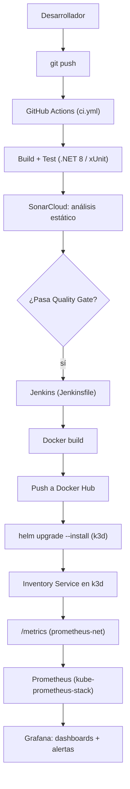

# Laboratorio técnico: pipeline CI/CD con seguridad y monitoreo

## Actividad 4

**Integrantes:** Sergio Cobos, David Vasquez y Sebastián Bedoya Flórez
**Asignatura:** `Fundamentos DevOps`
**Fecha:** `[completar]`
**Repositorio:** [Final Project Software Architecture](https://github.com/sergioandresco/Final-Project-Software-Architecture)

> Este documento es la continuación de [`readme.md`](../readme.md) (Actividad 3, que
> cubrió los pipelines CI/CD base con GitHub Actions). Esta actividad añade un segundo
> motor de pipeline (Jenkins), análisis estático de código (SonarCloud) y monitoreo
> (Prometheus + Grafana) sobre el clúster Kubernetes.

---

## 1. Introducción

Sobre la base construida en la Actividad 3 (dos workflows de GitHub Actions para CI y CD),
esta fase incorpora prácticas de seguridad y observabilidad al ciclo de vida de
**Inventory Service**: análisis estático de código, un segundo pipeline (Jenkins) para la
entrega continua hacia el clúster Kubernetes, y un stack de monitoreo
(Prometheus + Grafana) sobre dicho clúster.

## 2. Objetivo del laboratorio

Implementar un pipeline CI/CD completo que integre prácticas de seguridad y monitoreo,
fortaleciendo la eficiencia operativa y la cobertura del ciclo de vida de desarrollo de
software:

i. Pipeline CI/CD funcional (GitHub Actions + Jenkins).
ii. Integración de herramientas de seguridad: SonarQube (SonarCloud).
iii. Integración de monitoreo: Prometheus y Grafana.

## 3. Herramientas utilizadas y justificación

| Herramienta | Rol en el pipeline | Justificación |
|---|---|---|
| **GitHub Actions** | CI: build, test, análisis estático (`.github/workflows/ci.yml`) | Ya integrado al repositorio (Actividad 3); se ejecuta en cada push/PR sin infraestructura propia que mantener. |
| **Jenkins** | CD: build de imagen Docker, push a Docker Hub, despliegue a k3d vía Helm (`Jenkinsfile`) | Requerido por el laboratorio como segundo motor de pipeline; se usa para la etapa de *entrega*, separada de la validación de CI, ilustrando un flujo con dos herramientas de automatización distintas. |
| **SonarCloud** | Análisis estático de código (calidad, code smells, vulnerabilidades conocidas, cobertura) | Versión SaaS gratuita de SonarQube: sin servidor propio que operar, se integra directamente en `ci.yml` vía `dotnet-sonarscanner`. Se eligió como única herramienta de seguridad (en vez de sumar también Snyk) para mantener un solo Quality Gate como fuente de verdad. |
| **Prometheus** (`kube-prometheus-stack`) | Recolección de métricas de la app y del clúster | Estándar de facto en Kubernetes; el chart `kube-prometheus-stack` añade automáticamente kube-state-metrics y node-exporter, cubriendo métricas de pods sin configuración adicional. |
| **Grafana** | Visualización de métricas y alertas | Se despliega junto con Prometheus en el mismo chart; permite dashboards y alerting básico sobre las métricas recolectadas. |
| **prometheus-net.AspNetCore** | Instrumentación de la app (`/metrics`) | Expone métricas HTTP (tasa de requests, latencia, códigos de respuesta) directamente desde el microservicio, complementando las métricas de infraestructura. |

## 4. Arquitectura general

## 5. Descripción del flujo CI/CD

### 5.1 CI — GitHub Actions (`.github/workflows/ci.yml`)

Se ejecuta en cada `push`/`pull_request` a `development` o `main`. Un único job,
**`build-test-analyze`**: restaura, compila, ejecuta las pruebas de
`InventoryService.Tests` con recolección de cobertura (`--collect:"XPlat Code Coverage"`)
y envuelve todo entre `dotnet sonarscanner begin`/`end` para publicar el análisis en
SonarCloud (proyecto `sergioandresco_Final-Project-Software-Architecture`), incluyendo
detección de code smells, vulnerabilidades conocidas y cobertura de pruebas.

### 5.2 CD — Jenkins (`Jenkinsfile`)

Pipeline declarativo con 5 etapas: `Checkout → Build & Test (.NET) → Docker Build →
Docker Push → Deploy to k3d`. Jenkins corre localmente vía `Jenkins/docker-compose.yml`
(imagen propia con Docker CLI, `kubectl` y `helm` preinstalados — ver
[`Jenkins/README.md`](../Jenkins/README.md) para la puesta en marcha completa y las
credenciales requeridas).

### 5.3 Monitoreo — Prometheus + Grafana

`kube-prometheus-stack` se instala una sola vez en el clúster k3d (namespace `monitoring`).
El chart de la aplicación (`inventory-chart`) expone opcionalmente un `ServiceMonitor`
(`--set monitoring.enabled=true`) para que Prometheus scrapee `/metrics` cada 15s. Ver
[`Monitoring/README.md`](../Monitoring/README.md) para la instalación, el dashboard
(`Monitoring/inventory-service-dashboard.json`) y la alerta básica configurada en Grafana.

## 6. Evidencia de seguridad

> **Pendiente de completar** con capturas reales tras ejecutar el pipeline.

- [ ] Captura del análisis de SonarCloud (Quality Gate, code smells, cobertura).
- [ ] Resumen de hallazgos y recomendaciones de mejora:

| Hallazgo | Severidad | Recomendación |
|---|---|---|
| _(completar)_ | | |

## 7. Evidencia de monitoreo

> **Pendiente de completar** con capturas reales del dashboard.

- [ ] Captura del dashboard de Grafana (`Inventory Service`) con datos en vivo.
- [ ] Captura de los targets de Prometheus (`/targets`) mostrando `inventory-service` como `UP`.
- [ ] Captura de la alerta configurada (`Alerting → Alert rules`) en estado `Normal`/`Firing`.
- [ ] Enlace al dashboard (si se expone públicamente) o capturas adjuntas.

## 8. Evidencia de ejecución de pipelines

> **Pendiente de completar.**

- [ ] Captura del pipeline `ci.yml` ejecutándose en GitHub Actions (job `build-test-analyze` en verde).
- [ ] Captura del pipeline de Jenkins ejecutándose (las 5 etapas en verde).

## 9. Reflexión sobre eficiencia operativa

> **Borrador a personalizar** con la experiencia real del equipo tras ejecutar los pipelines.
> Preguntas guía: ¿cuánto tiempo toma cada pipeline? ¿qué etapa es el cuello de botella?
> ¿los hallazgos de Sonar cambiaron algo del código? ¿qué tan útil resultó tener
> métricas de la app además de las del clúster?

Contar con dos pipelines separados (GitHub Actions para CI, Jenkins para CD) permite que
la validación de calidad y seguridad ocurra temprano —en cada push— sin acoplarla al
proceso de despliegue, que solo se dispara de forma deliberada. La instrumentación de la
propia aplicación con `prometheus-net` complementa las métricas de infraestructura que ya
provee `kube-prometheus-stack`: las métricas de pod (CPU, memoria, reinicios) explican
*si* el servicio está sano, mientras que las métricas HTTP (tasa de requests, p95, errores
5xx) explican *cómo* se está comportando desde la perspectiva del cliente.

## 10. Conclusiones

_(completar tras ejecutar los pipelines y revisar los hallazgos de seguridad)_
