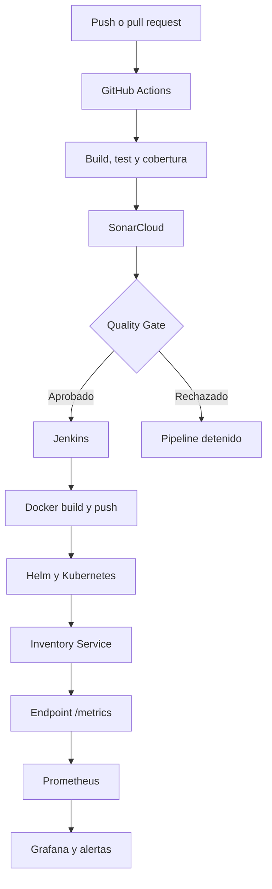

# Laboratorio técnico: pipeline CI/CD con seguridad y monitoreo

## Actividad 4 — Segundo entregable del proyecto

**Integrantes:** Sergio Cobos, David Vasquez y Sebastián Bedoya Flórez  
**Asignatura:** Fundamentos DevOps  
**Fecha:** Agosto de 2026  
**Repositorio:** [Final Project Software Architecture](https://github.com/sergioandresco/Final-Project-Software-Architecture)

> Este documento corresponde al segundo entregable del proyecto y continúa el trabajo presentado en el [README de la Actividad 3](README-actividad-3.md). En esta fase se incorporan Jenkins, análisis estático con SonarCloud y monitoreo con Prometheus y Grafana sobre Kubernetes.

---

## 1. Introducción

Sobre la base construida en la Actividad 3, esta fase incorpora prácticas de seguridad y observabilidad al ciclo de vida de **Inventory Service**. La solución amplía el flujo inicial mediante análisis estático de código, un segundo pipeline con Jenkins para la entrega y despliegue sobre Kubernetes y un stack de monitoreo compuesto por Prometheus y Grafana.

La aplicación fue desarrollada en ASP.NET Core 8, utiliza Entity Framework Core y SQLite, cuenta con pruebas automatizadas y se empaqueta mediante Docker. El despliegue se realiza sobre un clúster local de Kubernetes creado con k3d y parametrizado mediante Helm.

La implementación busca cubrir no solo la validación y entrega del código, sino también su seguridad antes del despliegue y su comportamiento durante la operación.

---

## 2. Objetivo del laboratorio

Implementar un pipeline CI/CD completo que integre prácticas de seguridad y monitoreo, fortaleciendo la eficiencia operativa y ampliando la cobertura del ciclo de vida de desarrollo de software.

Los objetivos específicos son:

1. Implementar integración continua mediante GitHub Actions.
2. Implementar entrega y despliegue continuo mediante Jenkins.
3. Integrar análisis estático y un Quality Gate mediante SonarCloud.
4. Recolectar métricas de la aplicación y Kubernetes mediante Prometheus.
5. Visualizar métricas clave en un dashboard de Grafana.
6. Configurar una alerta básica que permita identificar la indisponibilidad del servicio.
7. Documentar los resultados de seguridad, las recomendaciones y la reflexión sobre eficiencia operativa.

---

## 3. Herramientas utilizadas y justificación

| Herramienta | Rol en la solución | Justificación |
|---|---|---|
| **GitHub Actions** | Integración continua: compilación, pruebas, cobertura y análisis estático | Se integra directamente con el repositorio y ejecuta validaciones automáticas ante cambios en las ramas principales. |
| **Jenkins** | Entrega y despliegue: construcción y publicación de la imagen y actualización de Kubernetes | Permite definir stages explícitos y separar el despliegue de las validaciones realizadas durante CI. |
| **SonarCloud** | Análisis estático, cobertura y Quality Gate | Proporciona las capacidades de SonarQube como servicio administrado, evitando desplegar infraestructura adicional para el laboratorio. |
| **Docker** | Empaquetado de Inventory Service | Genera un artefacto consistente que contiene la aplicación, el runtime y sus dependencias. |
| **Docker Hub** | Registro de imágenes | Almacena las imágenes generadas por Jenkins y permite que Kubernetes descargue la versión seleccionada. |
| **Kubernetes / k3d** | Ejecución de la aplicación | Proporciona pods, servicios, sondas de salud, réplicas y administración de recursos. |
| **Helm** | Automatización del despliegue | Parametriza la imagen, réplicas, recursos y configuración de monitoreo. |
| **Prometheus** | Recolección de métricas | Obtiene métricas de Kubernetes y de la aplicación mediante consultas periódicas. |
| **Grafana** | Dashboards y alertas | Permite visualizar métricas clave y configurar alertas operativas. |
| **prometheus-net.AspNetCore** | Instrumentación de la API | Expone métricas HTTP directamente desde Inventory Service mediante el endpoint `/metrics`. |
| **xUnit y Moq** | Pruebas automatizadas | Validan controladores, servicios, DTO y escenarios de error antes del despliegue. |

---

## 4. Arquitectura general



El flujo asigna responsabilidades diferenciadas:

- GitHub Actions compila, prueba y analiza el código.
- SonarCloud evalúa los criterios de calidad y seguridad.
- Jenkins construye la imagen, la publica y despliega la aplicación.
- Kubernetes mantiene las instancias del servicio.
- Prometheus recolecta las métricas.
- Grafana presenta la información y administra las alertas.

---

## 5. Descripción del flujo CI/CD

### 5.1 Integración continua — GitHub Actions

**Archivo:** `.github/workflows/ci.yml`  
**Job:** `build-test-analyze`

El workflow se ejecuta automáticamente ante:

- `push` hacia `development` o `main`.
- `pull_request` dirigido a `development` o `main`.

El job realiza:

1. Checkout del repositorio.
2. Configuración de .NET 8.
3. Configuración de Java 17 para SonarScanner.
4. Configuración de caché para SonarCloud.
5. Instalación de `dotnet-sonarscanner`.
6. Restauración de dependencias.
7. Inicio del análisis de SonarCloud.
8. Compilación de la solución en modo `Release`.
9. Ejecución de pruebas con cobertura.
10. Publicación del análisis y validación del Quality Gate.

Las pruebas se encuentran en:

```text
Microservicios_y_Docker/tests/InventoryService.Tests/
```

#### Quality Gate bloqueante

El Quality Gate está configurado como control bloqueante mediante:

```text
/d:sonar.qualitygate.wait=true
```

Con esta configuración, GitHub Actions espera la evaluación de SonarCloud. Si el Quality Gate es aprobado, el workflow continúa y finaliza satisfactoriamente. Si los criterios no se cumplen, el job termina con error y el cambio no se considera validado.

### 5.2 Entrega y despliegue — Jenkins

**Archivo:** `Jenkinsfile`

El pipeline declarativo contiene cinco stages:

| Stage | Descripción |
|---|---|
| Checkout | Obtiene el código fuente desde GitHub |
| Build & Test (.NET) | Restaura, compila y prueba la solución |
| Docker Build | Construye la imagen y asigna las etiquetas del número de build y `latest` |
| Docker Push | Publica las imágenes en Docker Hub |
| Deploy to k3d | Ejecuta `helm upgrade --install` para actualizar Kubernetes |

Las imágenes generadas siguen la convención:

```text
sergiocosu/inventory-service:<BUILD_NUMBER>
sergiocosu/inventory-service:latest
```

El despliegue utiliza el número específico del build, lo cual permite relacionar la ejecución de Jenkins con la imagen y la versión desplegada.

Las credenciales se administran desde Jenkins:

| ID | Tipo | Finalidad |
|---|---|---|
| `dockerhub-credentials` | Username with password | Publicación en Docker Hub |
| `k3d-kubeconfig` | Secret file | Acceso al clúster k3d |

La instalación y configuración se documentan en [`Jenkins/README.md`](../Jenkins/README.md).

### 5.3 Despliegue en Kubernetes

El chart `inventory-chart` contiene:

- Deployment de Inventory Service.
- Service de tipo ClusterIP.
- Sondas de liveness y readiness.
- Requests y limits de recursos.
- Desactivación del montaje innecesario del token de Service Account.
- ServiceMonitor opcional para Prometheus.

Jenkins actualiza el despliegue mediante:

```bash
helm upgrade --install inventory ./inventory-chart \
  --set image.repository=sergiocosu/inventory-service \
  --set image.tag=<BUILD_NUMBER> \
  --wait \
  --timeout 2m
```

### 5.4 Monitoreo — Prometheus y Grafana

El stack `kube-prometheus-stack` instala:

- Prometheus.
- Grafana.
- Alertmanager.
- kube-state-metrics.
- node-exporter.

La API utiliza `prometheus-net.AspNetCore` y expone:

```text
GET /metrics
```

El `ServiceMonitor` indica a Prometheus que consulte el endpoint cada 15 segundos. La configuración se habilita mediante:

```bash
helm upgrade --install inventory ./inventory-chart \
  --set monitoring.enabled=true
```

Las instrucciones completas se encuentran en [`Monitoring/README.md`](../Monitoring/README.md).

---

## 6. Resultados y evidencia de seguridad

SonarCloud se integró al pipeline de GitHub Actions mediante `dotnet-sonarscanner`. El análisis comprende vulnerabilidades, bugs, code smells, duplicación, cobertura y criterios de mantenibilidad.

El primer análisis registró un **Security Rating E** y 21 hallazgos clasificados como vulnerabilidades. Los resultados se concentraron principalmente en el fortalecimiento de pipelines, contenedores y manifiestos de Kubernetes.

| Hallazgo | Severidad | Archivos | Acción aplicada |
|---|---|---|---|
| Interpolación directa de secretos | High | `.github/workflows/ci.yml` | Consumo de `SONAR_TOKEN` mediante una variable de entorno |
| Instalación mediante `curl \| bash` | Blocker | `Jenkins/Dockerfile` | Descarga del binario y validación de checksum SHA-256 |
| Solicitudes `curl` sin restricciones explícitas | High | `Jenkins/Dockerfile` | Incorporación de HTTPS y TLS 1.2 |
| Contenedores sin límites de memoria | High | Manifiestos Kubernetes y chart Helm | Definición de requests y limits |
| Token de Service Account innecesario | High | Manifiestos Kubernetes y chart Helm | Configuración de `automountServiceAccountToken: false` |
| Acciones identificadas mediante tags mutables | High | Workflows de GitHub Actions | Fijación de acciones mediante SHA completo |

Después de aplicar las correcciones, se ejecutó nuevamente el análisis para comprobar su efecto.

Enlace de acceso al dashboard [`Dashboard SonarCloud`](https://sonarcloud.io/project/overview?id=sergioandresco_Final-Project-Software-Architecture)

### 6.1 Evidencias


<br><br><br>

### 6.2 Recomendaciones de seguridad

1. Mantener el Quality Gate como criterio bloqueante.
2. Corregir prioritariamente hallazgos Blocker y Critical.
3. Revisar periódicamente las imágenes base y dependencias.
4. Mantener las acciones de GitHub fijadas mediante SHA.
5. Administrar credenciales mediante GitHub Secrets, Jenkins Credentials y Secrets de Kubernetes.
6. Conservar requests y limits en los despliegues.
7. Documentar los hallazgos aceptados que no puedan corregirse inmediatamente.
8. Revisar la evolución de la cobertura y deuda técnica en cada entrega.
9. No almacenar contraseñas de Grafana directamente en archivos versionados.

---

## 7. Resultados y evidencia de monitoreo

El monitoreo se implementó mediante `kube-prometheus-stack`. Inventory Service expone el endpoint `/metrics`, mientras que el `ServiceMonitor` permite que Prometheus recolecte las métricas cada 15 segundos.

El dashboard de Grafana presenta:

- Pods disponibles.
- Reinicios de contenedores.
- Consumo de CPU por pod.
- Consumo de memoria por pod.
- Tasa de solicitudes HTTP.
- Latencia p95.
- Tasa de errores 5xx.

También se configuró una alerta que se activa cuando no existe ningún pod de Inventory Service listo durante dos minutos.

### 7.1 Evidencias


<br><br><br>

---

## 8. Evidencia de ejecución de los pipelines

### 8.1 Pipeline CI - GitHub Actions


<br><br><br>

### 8.2 Pipeline CD - Jenkins


<br><br><br>

---

## 9. Reflexión sobre eficiencia operativa

La implementación evidencia que un pipeline DevOps no debe limitarse a compilar y desplegar una aplicación. La incorporación de pruebas, análisis estático y un Quality Gate permite detectar problemas antes de generar una entrega. Al configurarse como bloqueante, SonarCloud deja de ser únicamente una herramienta informativa y se convierte en un criterio automático de aceptación.

La separación entre GitHub Actions y Jenkins asigna responsabilidades claras. GitHub Actions valida el código ante cambios en el repositorio, mientras Jenkins construye la imagen, la publica y actualiza Kubernetes. Esta separación facilita identificar en qué etapa ocurre un error y evita ejecutar todos los procesos manualmente.

La automatización también mejora la trazabilidad. El código, la ejecución del pipeline, el análisis de seguridad, la imagen Docker y el despliegue pueden relacionarse mediante el commit y el número de build. Esto facilita repetir el proceso, investigar errores y regresar a una versión específica cuando sea necesario.

Prometheus y Grafana amplían la cobertura hacia la operación. Las métricas de CPU, memoria, pods y reinicios muestran la salud de la infraestructura; las métricas HTTP permiten evaluar la tasa de solicitudes, latencia y errores desde la perspectiva de la aplicación. La alerta de disponibilidad disminuye la dependencia de revisiones manuales y facilita detectar oportunamente una interrupción.

---

## 10. Conclusiones

La implementación permitió consolidar un pipeline que cubre integración continua, seguridad, entrega, despliegue y monitoreo. GitHub Actions automatiza la compilación, las pruebas y el análisis estático; Jenkins construye y publica la imagen y actualiza Kubernetes; mientras Prometheus y Grafana permiten observar la aplicación después del despliegue.

El análisis de SonarCloud demostró que la seguridad también comprende los archivos de automatización, contenedores y manifiestos de infraestructura. Los hallazgos permitieron fortalecer el manejo de secretos, la integridad de las herramientas descargadas, los límites de recursos y el uso de referencias inmutables. La configuración bloqueante del Quality Gate asegura que estos criterios sean considerados antes de aprobar un cambio.

El dashboard de Grafana integra métricas de aplicación e infraestructura, permitiendo evaluar disponibilidad, consumo de recursos y comportamiento HTTP. La alerta configurada aporta una señal temprana ante la ausencia de pods disponibles.

En conclusión, el laboratorio permitió transformar un flujo básico de CI/CD en un proceso con controles de calidad, seguridad y observabilidad. Esto mejora la repetibilidad de las entregas, reduce riesgos manuales y proporciona información para continuar fortaleciendo la operación.

