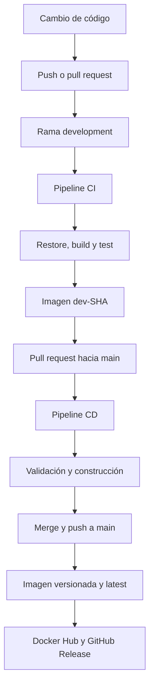

# Laboratorio técnico: implementación de pipelines CI/CD

## Actividad 3

**Integrantes:** Sergio Cobos, David Vasquez y Sebastián Bedoya Flórez  
**Asignatura:** `Fundamentos DevOps`
**Fecha:** `Agosto 2026`
**Repositorio:** [Final Project Software Architecture](https://github.com/sergioandresco/Final-Project-Software-Architecture)

---

## 1. Introducción

Este repositorio contiene una aplicación web para la gestión de inventarios y la implementación de una estrategia básica de integración continua y entrega continua (CI/CD).

La aplicación fue desarrollada en **ASP.NET Core 8**, utiliza **Entity Framework Core** y **SQLite** para la persistencia de información, y está organizada siguiendo principios de **Clean Architecture**. Su empaquetado se realiza mediante **Docker**.

Para el laboratorio se configuraron dos pipelines con **GitHub Actions**:

- Un pipeline de integración continua asociado a la rama `development`.
- Un pipeline de entrega continua asociado a la rama `main`.

Los pipelines automatizan la descarga del código, restauración de dependencias, compilación, ejecución de pruebas, construcción de imágenes Docker, publicación en Docker Hub y creación de versiones en GitHub.

> La aplicación base fue desarrollada previamente por el mismo equipo de trabajo en otro proyecto académico. El alcance de esta actividad se concentra en la estructuración, implementación y documentación de los pipelines CI/CD.

---

## 2. Objetivo del laboratorio

Implementar dos pipelines que automaticen la validación y preparación de entregas de una aplicación web alojada en GitHub:

- **Integración continua (CI):** compilar, probar y validar automáticamente el código ante cambios en el repositorio.
- **Entrega continua (CD):** construir una imagen Docker versionada y publicarla en un registro, dejándola disponible para su posterior despliegue en diferentes entornos.

---

## 3. Alcance

Para esta implementación se seleccionó **GitHub Actions** como herramienta de automatización tanto para CI como para CD.

La selección permite mantener el código y la automatización dentro del mismo repositorio. Se definió un workflow para validar los cambios integrados en `development` y un segundo workflow para preparar las entregas asociadas a `main`.

El alcance de esta fase termina con:

- La validación automática del código.
- La ejecución de pruebas automatizadas.
- La construcción de la imagen Docker.
- La publicación de la imagen en Docker Hub.
- La creación de prereleases y releases en GitHub.

El despliegue automático en Kubernetes, la integración de controles de seguridad y la habilitación de monitoreo corresponden a fases posteriores del proyecto.

---

## 4. Descripción de la aplicación

**Inventory Service** es una API REST que permite administrar productos y sus existencias. Las operaciones principales son:

| Método | Endpoint | Descripción |
|---|---|---|
| `GET` | `/api/products` | Consultar todos los productos |
| `GET` | `/api/products/{id}` | Consultar un producto por identificador |
| `POST` | `/api/products` | Crear un producto |
| `PUT` | `/api/products/{id}` | Actualizar un producto |
| `PATCH` | `/api/products/{id}/stock` | Registrar una entrada o salida de inventario |
| `DELETE` | `/api/products/{id}` | Eliminar un producto |
| `GET` | `/health/live` | Validar que el proceso esté activo |
| `GET` | `/health/ready` | Validar que la aplicación esté lista para atender solicitudes |
| `GET` | `/swagger` | Consultar la documentación interactiva de la API |

---

## 5. Tecnologías utilizadas

| Tecnología | Propósito |
|---|---|
| ASP.NET Core 8 | Desarrollo de la API web |
| Entity Framework Core | Acceso y persistencia de datos |
| SQLite | Base de datos de la aplicación |
| xUnit | Ejecución de pruebas automatizadas |
| Moq | Simulación de dependencias en las pruebas unitarias |
| Git y GitHub | Control de versiones y alojamiento del código |
| GitHub Actions | Automatización de los pipelines CI/CD |
| Docker | Construcción y empaquetado de la aplicación |
| Docker Hub | Registro de imágenes Docker |
| QEMU y Docker Buildx | Construcción de imágenes multiplataforma |
| Swagger / OpenAPI | Documentación y validación de la API |

---

## 6. Estructura relevante del repositorio

```text
.
├── .github/
│   └── workflows/
│       ├── ci-development.yml
│       └── cd-main.yml
├── Microservicios_y_Docker/
│   ├── src/
│   │   ├── InventoryService.Api/
│   │   ├── InventoryService.Application/
│   │   ├── InventoryService.Domain/
│   │   └── InventoryService.Infrastructure/
│   ├── tests/
│   │   └── InventoryService.Tests/
│   │       ├── Api/Controllers/
│   │       └── Application/Products/
│   ├── Dockerfile
│   ├── docker-compose.yml
│   └── InventoryService.sln
├── Kubernetes/
├── inventory-chart/
├── application.yaml
└── README.md
```

Los directorios `Kubernetes`, `inventory-chart` y el archivo `application.yaml` contienen recursos desarrollados previamente y previstos para fases posteriores. Estos elementos no forman parte del alcance evaluado de los pipelines de esta actividad.

---

## 7. Estrategia de ramas

| Rama | Propósito | Automatización asociada |
|---|---|---|
| `development` | Integración y validación de cambios en desarrollo | Pipeline CI |
| `main` | Código estable y generación de entregas versionadas | Pipeline CD |

Los cambios se integran inicialmente en `development`. Después de superar las validaciones automáticas, se crea un pull request hacia `main`. Este pull request vuelve a ejecutar las validaciones definidas en el pipeline CD y, después de su integración, el `push` resultante sobre `main` genera la entrega estable.

---

## 8. Flujo general CI/CD



---

## 9. Pipeline de integración continua

**Archivo:** `.github/workflows/ci-development.yml`  
**Rama objetivo:** `development`

### 9.1 Disparadores

El pipeline se ejecuta automáticamente cuando:

- Se realiza un `push` sobre `development`.
- Se crea o actualiza un pull request dirigido a `development`.

```yaml
on:
  push:
    branches: [development]
  pull_request:
    branches: [development]
```

### 9.2 Etapas del pipeline CI

| Etapa | Descripción |
|---|---|
| Checkout code | Descarga el código del repositorio en el runner |
| Setup .NET 8 | Instala y configura el SDK de .NET 8 |
| Restore dependencies | Restaura las dependencias NuGet de la solución |
| Build | Compila la solución en configuración `Release` |
| Test | Ejecuta las pruebas automatizadas |
| Set up QEMU | Habilita la emulación requerida para otras arquitecturas |
| Set up Docker Buildx | Prepara la construcción de imágenes multiplataforma |
| Log in to Docker Hub | Autentica el workflow mediante secretos de GitHub |
| Build & push | Construye y publica la imagen de desarrollo |
| Create GitHub Pre-Release | Crea una versión preliminar asociada al commit |

### 9.3 Versionamiento de desarrollo

Las imágenes generadas en `development` utilizan el SHA del commit para garantizar trazabilidad:

```text
<usuario-dockerhub>/inventory-service:dev-<SHA-del-commit>
```

Este identificador permite relacionar cada imagen con el cambio exacto que la produjo.

---

## 10. Pruebas automatizadas

Las pruebas se encuentran en:

```text
Microservicios_y_Docker/tests/InventoryService.Tests/
```

El proyecto utiliza **xUnit**, **Moq** y el SDK de pruebas de .NET. Actualmente la solución contiene métodos de prueba para:

- Operaciones del controlador de productos.
- Lógica del servicio de productos.
- Creación, consulta, actualización y eliminación de productos.
- Entradas y salidas de inventario.
- Validación de DTO y datos de entrada.
- Manejo de productos inexistentes.
- Manejo de solicitudes y operaciones inválidas.

Las pruebas forman parte de `InventoryService.sln` y son ejecutadas automáticamente mediante:

```bash
dotnet test Microservicios_y_Docker/InventoryService.sln \
  --no-build \
  --configuration Release \
  --verbosity normal
```

Si alguna prueba falla, el pipeline finaliza con error y evita que el cambio sea considerado válido.

---

## 11. Pipeline de entrega continua

**Archivo:** `.github/workflows/cd-main.yml`  
**Rama objetivo:** `main`

### 11.1 Disparadores

El pipeline se ejecuta automáticamente cuando:

- Se realiza un `push` sobre `main`.
- Se crea o actualiza un pull request dirigido a `main`.

```yaml
on:
  push:
    branches: [main]
  pull_request:
    branches: [main]
```

### 11.2 Etapas del pipeline CD

| Etapa | Descripción |
|---|---|
| Checkout code | Descarga el repositorio y el historial requerido para consultar tags |
| Setup .NET 8 | Configura el SDK de .NET 8 |
| Restore dependencies | Restaura las dependencias de la solución |
| Build | Compila la aplicación en configuración `Release` |
| Test | Ejecuta nuevamente las pruebas automatizadas |
| Generate version | Obtiene el último tag estable e incrementa su componente `patch` |
| Set up QEMU | Habilita la construcción para múltiples arquitecturas |
| Set up Docker Buildx | Prepara el constructor de imágenes Docker |
| Log in to Docker Hub | Autentica el workflow de manera segura |
| Build & push Docker image | Publica la imagen versionada y la etiqueta `latest` |
| Create GitHub Release | Crea el tag y el release correspondiente en GitHub |

### 11.3 Versionamiento estable

El workflow consulta el último tag con formato semántico:

```text
v<major>.<minor>.<patch>
```

Luego incrementa automáticamente el valor `patch`. Por ejemplo:

```text
v1.0.12 → v1.0.13
```

Por cada entrega se publican dos etiquetas de imagen:

```text
<usuario-dockerhub>/inventory-service:1.0.13
<usuario-dockerhub>/inventory-service:latest
```

La etiqueta versionada proporciona trazabilidad e inmutabilidad de la entrega. La etiqueta `latest` facilita identificar la versión estable más reciente, aunque los despliegues controlados deberían utilizar preferiblemente una versión específica.

---

## 12. Generación y finalidad de las imágenes Docker

Como resultado de los pipelines se generan imágenes Docker que empaquetan la aplicación, su runtime y las dependencias necesarias para su ejecución. Esto permite conservar un artefacto consistente y trazable durante las siguientes etapas del proceso de entrega.

Las imágenes se construyen para las siguientes plataformas:

```text
linux/amd64
linux/arm64
```

Las imágenes tienen las siguientes finalidades:

- Representar una versión ejecutable de la aplicación después de superar la compilación y las pruebas.
- Mantener trazabilidad entre el commit, la versión publicada y el artefacto generado.
- Publicar versiones preliminares de desarrollo identificadas mediante el SHA del commit.
- Publicar versiones estables con una etiqueta semántica y con la etiqueta `latest`.
- Servir como artefacto de entrada para el despliegue posterior de la aplicación en Kubernetes.

Las imágenes se almacenan en Docker Hub para que puedan ser descargadas y utilizadas durante las fases posteriores del proyecto.

---

## 13. Configuración de secretos

Los pipelines utilizan secretos configurados en **Settings > Secrets and variables > Actions** dentro de GitHub:

| Secreto | Propósito |
|---|---|
| `DOCKERHUB_USERNAME` | Nombre del usuario propietario de la imagen en Docker Hub |
| `DOCKERHUB_TOKEN` | Token utilizado para autenticar la publicación en Docker Hub |
| `GITHUB_TOKEN` | Token generado automáticamente por GitHub para crear tags y releases |

Las credenciales no se almacenan directamente en los archivos YAML ni en el código fuente.

---

## 14. Ejecución local

### 14.1 Requisitos

- .NET SDK 8.
- Docker.
- Git.

### 14.2 Restaurar dependencias

```bash
dotnet restore Microservicios_y_Docker/InventoryService.sln
```

### 14.3 Compilar la solución

```bash
dotnet build Microservicios_y_Docker/InventoryService.sln \
  --configuration Release \
  --no-restore
```

### 14.4 Ejecutar pruebas

```bash
dotnet test Microservicios_y_Docker/InventoryService.sln \
  --configuration Release \
  --no-build
```

### 14.5 Construir la imagen Docker

Desde la raíz del repositorio:

```bash
docker build \
  -t inventory-service:local \
  -f Microservicios_y_Docker/Dockerfile \
  Microservicios_y_Docker
```

### 14.6 Ejecutar el contenedor

```bash
docker run --rm -p 8080:8080 inventory-service:local
```

La documentación Swagger estará disponible en:

```text
http://localhost:8080/swagger
```

---

## 15. Evidencias de ejecución

Esta sección reúne las evidencias solicitadas para demostrar la ejecución de los dos pipelines mediante pull requests.

### 15.1 Ejecución del pipeline CI mediante pull request

> Ejecución exitosa de `CI - Development` originada por un pull request hacia `development`.


<br><br><br>

### 15.2 Ejecución del pipeline CD mediante pull request

> Ejecución exitosa de `CD - Main` originada por un pull request hacia `main`.


<br><br><br>

---

## 16. Resultados

La implementación permite que cada cambio integrado en `development` sea compilado y probado automáticamente antes de generar una imagen preliminar. De manera complementaria, los pull requests y cambios dirigidos a `main` activan el pipeline de entrega, que vuelve a validar la solución y prepara una versión estable.

Los artefactos quedan identificados mediante el SHA del commit en desarrollo y mediante versionamiento semántico en las entregas estables. Esto proporciona trazabilidad entre el código fuente, la ejecución del pipeline, la imagen Docker y el release generado.

---

## 17. Conclusiones

GitHub Actions permitió implementar los procesos de integración y entrega continua dentro del mismo repositorio del proyecto. La automatización reduce las verificaciones manuales, detecta errores antes de preparar una entrega y asegura que la imagen publicada provenga de código compilado y probado.

La separación entre `development` y `main` diferencia las validaciones preliminares de las entregas estables. Por su parte, Docker proporciona un artefacto portable que servirá como entrada para la futura implementación en Kubernetes, junto con los controles de seguridad y monitoreo contemplados en las siguientes fases del proyecto.
