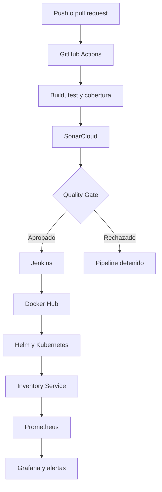

# Inventory Service — CI/CD, seguridad y monitoreo

**Integrantes:** Sergio Cobos, David Vasquez y Sebastián Bedoya Flórez  
**Asignatura:** Fundamentos DevOps  
**Fecha:** `30 Agosto 2026`  
**Repositorio:** [Final Project Software Architecture](https://github.com/sergioandresco/Final-Project-Software-Architecture)

> [!IMPORTANT]
> Este repositorio contiene entregables consecutivos del proyecto. La documentación detallada, junto con las capturas de evidencia de cada actividad, se encuentra en los siguientes archivos.

| Entregable | Alcance | Documentación y evidencias |
|---|---|---|
| Actividad 3 | Implementación inicial de pipelines CI/CD con GitHub Actions | [`docs/README-actividad-3.md`](docs/README-actividad-3.md) |
| Actividad 4 | Pipeline con Jenkins, seguridad con SonarCloud y monitoreo con Prometheus y Grafana | [`docs/informe-tecnico-seguridad-monitoreo.md`](docs/informe-tecnico-seguridad-monitoreo.md) |

---

## 1. Descripción general

**Inventory Service** es una API REST para la gestión de productos e inventario. Fue desarrollada en **ASP.NET Core 8**, utiliza **Entity Framework Core** y **SQLite**, y está organizada siguiendo principios de **Clean Architecture**.

El proyecto incorpora un flujo DevOps que cubre:

- Integración continua con GitHub Actions.
- Pruebas automatizadas con xUnit y Moq.
- Análisis estático y Quality Gate con SonarCloud.
- Construcción y publicación de imágenes Docker.
- Entrega y despliegue con Jenkins.
- Despliegue en Kubernetes mediante Helm y k3d.
- Recolección de métricas con Prometheus.
- Visualización y alertas con Grafana.

---

## 2. Arquitectura general



El flujo separa las responsabilidades principales:

- **GitHub Actions** compila, prueba y analiza el código.
- **SonarCloud** evalúa calidad y seguridad mediante un Quality Gate bloqueante.
- **Jenkins** construye la imagen, la publica y despliega la aplicación.
- **Kubernetes** ejecuta y mantiene las instancias del servicio.
- **Prometheus y Grafana** permiten observar el comportamiento posterior al despliegue.

---

## 3. Tecnologías utilizadas

| Tecnología | Propósito |
|---|---|
| ASP.NET Core 8 | Desarrollo de la API REST |
| Entity Framework Core | Acceso y persistencia de datos |
| SQLite | Base de datos de la aplicación |
| xUnit y Moq | Pruebas automatizadas y simulación de dependencias |
| GitHub | Repositorio, ramas y pull requests |
| GitHub Actions | Integración continua |
| SonarCloud | Análisis estático, cobertura y Quality Gate |
| Jenkins | Entrega y despliegue continuo |
| Docker y Docker Hub | Construcción y almacenamiento de imágenes |
| Kubernetes y k3d | Ejecución de la aplicación en un clúster local |
| Helm | Parametrización y actualización del despliegue |
| Prometheus | Recolección de métricas |
| Grafana | Dashboards y alertas |

Para el análisis de seguridad se seleccionó **SonarCloud**, servicio basado en SonarQube.

---

## 4. Estructura del repositorio

```text
.
├── .github/
│   └── workflows/
│       ├── ci.yml
│       ├── ci-development.yml
│       └── cd-main.yml
├── docs/
│   ├── README-actividad-3.md
│   └── informe-tecnico-seguridad-monitoreo.md
├── Jenkins/
│   ├── Dockerfile
│   ├── docker-compose.yml
│   └── README.md
├── Kubernetes/
│   ├── Evidencias/
│   ├── inventory-deployment.yaml
│   ├── inventory-service.yaml
│   └── README.MD
├── Microservicios_y_Docker/
│   ├── src/
│   ├── tests/
│   ├── Dockerfile
│   ├── docker-compose.yml
│   └── InventoryService.sln
├── Monitoring/
│   ├── inventory-service-dashboard.json
│   ├── values-monitoring.yaml
│   └── README.md
├── inventory-chart/
│   ├── templates/
│   │   ├── deployment.yaml
│   │   ├── service.yaml
│   │   └── servicemonitor.yaml
│   ├── Chart.yaml
│   └── values.yaml
├── Jenkinsfile
├── application.yaml
└── README.md
```

---

## 5. Aplicación y endpoints

| Método | Endpoint | Descripción |
|---|---|---|
| `GET` | `/api/products` | Consultar todos los productos |
| `GET` | `/api/products/{id}` | Consultar un producto por identificador |
| `POST` | `/api/products` | Crear un producto |
| `PUT` | `/api/products/{id}` | Actualizar un producto |
| `PATCH` | `/api/products/{id}/stock` | Registrar una entrada o salida de inventario |
| `DELETE` | `/api/products/{id}` | Eliminar un producto |
| `GET` | `/health/live` | Validar que el proceso esté activo |
| `GET` | `/health/ready` | Validar que la aplicación esté lista |
| `GET` | `/metrics` | Exponer métricas para Prometheus |
| `GET` | `/swagger` | Consultar la documentación de la API |

---

## 6. Integración continua

El workflow principal se encuentra en:

```text
.github/workflows/ci.yml
```

Se ejecuta ante `push` y `pull_request` hacia `development` o `main`, y realiza:

1. Checkout del código.
2. Configuración de .NET 8 y Java 17.
3. Restauración de dependencias.
4. Inicio del análisis de SonarCloud.
5. Compilación de la solución.
6. Ejecución de pruebas con cobertura.
7. Publicación del análisis y validación del Quality Gate.

El Quality Gate está configurado como bloqueante mediante:

```text
/d:sonar.qualitygate.wait=true
```

Si SonarCloud rechaza el resultado, GitHub Actions finaliza con error y el cambio no se considera validado.

---

## 7. Entrega y despliegue con Jenkins

El pipeline se define en el archivo [`Jenkinsfile`](Jenkinsfile) y contiene los siguientes stages:

| Stage | Descripción |
|---|---|
| Checkout | Descarga el código desde GitHub |
| Build & Test (.NET) | Restaura, compila y ejecuta las pruebas |
| Docker Build | Construye la imagen con el número de ejecución |
| Docker Push | Publica la imagen versionada y `latest` en Docker Hub |
| Deploy to k3d | Actualiza el despliegue mediante Helm |

Las instrucciones para levantar Jenkins, configurar sus credenciales y crear el job se encuentran en [`Jenkins/README.md`](Jenkins/README.md).

---

## 8. Seguridad

SonarCloud analiza el código y los archivos de configuración para identificar vulnerabilidades, bugs, code smells, duplicación y cobertura.

El análisis inicial permitió detectar oportunidades de mejora relacionadas con:

- Uso seguro de secretos en GitHub Actions.
- Verificación de integridad durante la instalación de herramientas.
- Restricción de protocolo y TLS en descargas.
- Límites de recursos en Kubernetes.
- Montaje innecesario del token de Service Account.
- Uso de referencias inmutables para acciones de terceros.

Los resultados y las capturas de evidencia se encuentran en el [informe técnico de seguridad y monitoreo](docs/informe-tecnico-seguridad-monitoreo.md).

---

## 9. Monitoreo

La API utiliza `prometheus-net.AspNetCore` para exponer métricas HTTP en `/metrics`. El chart Helm incluye un `ServiceMonitor` opcional que permite a Prometheus consultar el endpoint cada 15 segundos.

El stack `kube-prometheus-stack` incorpora:

- Prometheus.
- Grafana.
- Alertmanager.
- kube-state-metrics.
- node-exporter.

El dashboard `Monitoring/inventory-service-dashboard.json` permite visualizar:

- Pods disponibles.
- Reinicios de contenedores.
- Consumo de CPU y memoria.
- Tasa de solicitudes HTTP.
- Latencia p95.
- Errores 5xx.

También se configuró una alerta básica para identificar cuando no existe ningún pod de Inventory Service listo durante dos minutos.

Las instrucciones de instalación e importación del dashboard se encuentran en [`Monitoring/README.md`](Monitoring/README.md).

---

## 10. Ejecución local de la aplicación

### Restaurar y compilar

```bash
dotnet restore Microservicios_y_Docker/InventoryService.sln
dotnet build Microservicios_y_Docker/InventoryService.sln \
  --configuration Release \
  --no-restore
```

### Ejecutar las pruebas

```bash
dotnet test Microservicios_y_Docker/InventoryService.sln \
  --configuration Release \
  --no-build
```

### Construir la imagen

```bash
docker build \
  -t inventory-service:local \
  -f Microservicios_y_Docker/Dockerfile \
  Microservicios_y_Docker
```

### Ejecutar el contenedor

```bash
docker run --rm -p 8080:8080 inventory-service:local
```

Swagger estará disponible en:

```text
http://localhost:8080/swagger
```

---

## 11. Documentación de los entregables

### Actividad 3

El primer entregable documenta la implementación inicial de CI/CD con GitHub Actions, pruebas automatizadas, construcción de imágenes Docker y versionamiento.

➡️ [Consultar README y evidencias de la Actividad 3](docs/README-actividad-3.md)

### Actividad 4

El segundo entregable contiene la descripción detallada del pipeline completo, análisis de seguridad, monitoreo, resultados, recomendaciones, reflexión sobre eficiencia operativa y capturas.

➡️ [Consultar informe técnico y evidencias de seguridad y monitoreo](docs/informe-tecnico-seguridad-monitoreo.md)

---

## 12. Resultado general

La solución integra validación, seguridad, entrega, despliegue y monitoreo dentro de un flujo trazable. GitHub Actions verifica el código antes de la entrega; SonarCloud convierte los criterios de calidad en un control automático; Jenkins construye y despliega la versión; y Prometheus junto con Grafana permite observar su comportamiento después del despliegue.

Esta integración reduce pasos manuales, facilita la detección temprana de errores y genera evidencia del estado del código, de la ejecución de los pipelines y de la operación de la aplicación.

